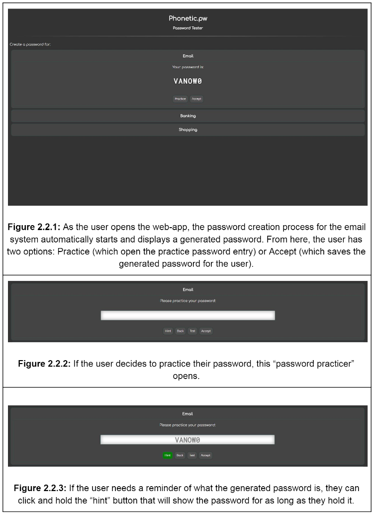
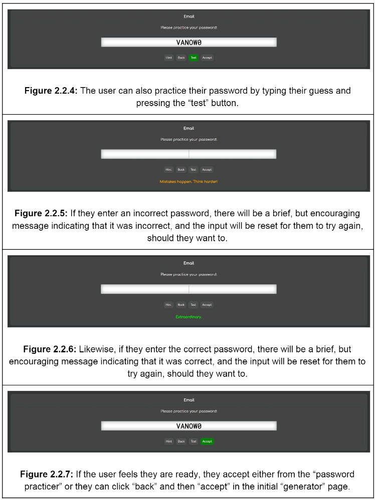
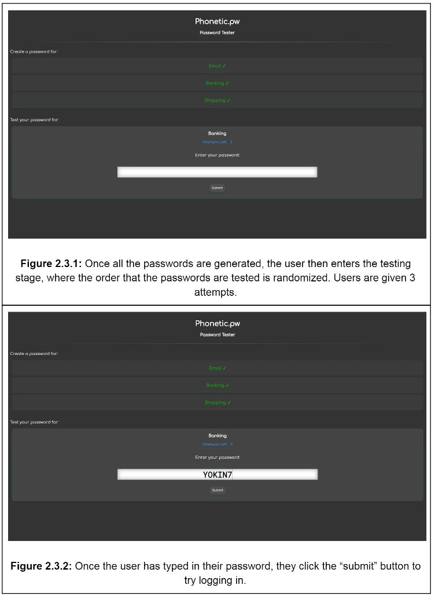

# phonetic.pw
This repository consists of a testing framework implementation that was developed to assess the usability of Phonetic.pw, a self-made password scheme that generates human readable phrases as passwords. The user of this framework is generated three unique passwords for different purposes (email, shopping, banking) and is then prompted to practice and test these passwords in random order to see how well they can remember them. As the user undergoes this process, the framework records relevant log data and outputs a spreadsheet containing the logs which are then used for statistical analysis to measure the memorability of the phonetic passwords.
* This framework was developed for COMP 3008 (Human-Computer Interaction), Winter 2018, at Carleton University

### Authors
* [Altin Rexhepaj](https://github.com/altin)
* [Jason Lai](https://github.com/jlai29)

### Facts
* Phonetic.pw can generate millions of unique passwords
* Phonetic passwords are easier to remember

### Usage
* Make sure you have Node.js installed on your system
* Clone the repository to your system
* Open your command line and navigate to the ```/phonetic.pw/src``` directory
* Type and enter ```npm install``` in the command line to install the necessary modules
* Type and enter ```node server.js``` in the command line to start the server
* Open your browser, then type and enter ```localhost:3008``` in the address bar

### Screenshots




### Development Details
#### Chrome
* HTML, CSS
* Javascript
  * jQuery
  * Node.js
